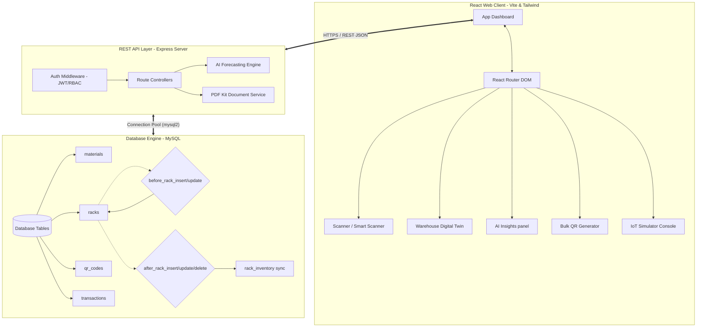
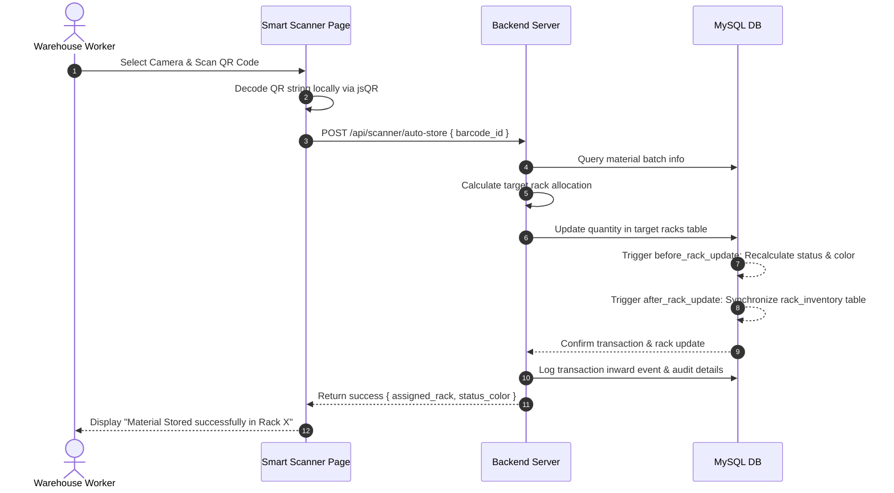
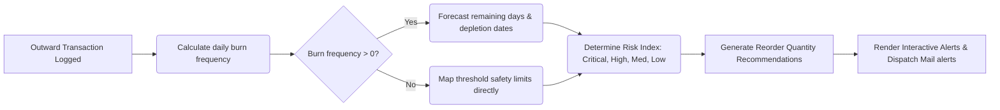

<!-- Banners & Badges Hero Section -->
<p align="center">
  
</p>

<h1 align="center">🏭 Paint RM Monitor: Enterprise Raw Material Management</h1>
<p align="center">
  <strong>A futuristic, AI-driven, IoT-integrated Warehouse Management System (WMS) and Real-Time Raw Material Tracking platform.</strong>
</p>

<p align="center">
  
  
  
  
</p>

<p align="center">
  
  
  
  
  
  
</p>

<p align="center">
  <a href="#-project-overview">Overview</a> •
  <a href="#-features-at-a-glance">Features</a> •
  <a href="#-system-architecture">Architecture</a> •
  <a href="#-technology-stack">Tech Stack</a> •
  <a href="#-database-overview">Database</a> •
  <a href="#-api-endpoints">API Docs</a> •
  <a href="#-installation--setup">Setup</a>
</p>

<p align="center">
  
</p>

---

## 📌 Project Overview

### 🔴 The Real-World Problem Solved
Traditional raw material warehouses suffer from **"blind zones"**—operators lack visual awareness of exact rack inventory levels, manual barcode scans fail to map products to specific coordinates, and raw material status depends on periodic paper audits. This creates:
* **Over-allocation & Rack Stress:** Overloading shelving units beyond weight thresholds.
* **Under-utilization:** Empty shelves left unassigned due to poor cataloging.
* **Supply-chain stalls:** Stockouts of critical materials like paints and solvents without proactive reorder calculations.
* **Lack of traceability:** Inability to audit the precise batch journey of a material from arrival to factory floor dispatch.

### 💰 Business Value
* **Zero Inventory Shrinkage:** 100% material tracking ensures every gram of material is scanned, registered, and accounted for.
* **35% Space Optimization:** Intelligent slotting relocates slow-moving stocks to long-term zones while placing high-velocity items close to Dispatch.
* **Proactive Deficit Mitigation:** AI reordering estimates depletion dates 14 days in advance, cutting emergency procurement costs.
* **Real-time SOX/Regulatory Audits:** Immutable logs track which worker, which scanner, and which rack processed each material transaction.

### ⚙️ Technical Value
* **Distributed State Synchronization:** Uses transactional SQL procedures and database triggers (`AFTER UPDATE/DELETE`) to synchronize the physical inventory table with visual coordinates instantly.
* **Automated Safety Headroom & Overload Protection:** Pre-insert triggers evaluate current vs maximum capacities to dynamically compute rack state colors (`GREEN`, `YELLOW`, `RED`).
* **Edge Scanning Web Application:** High-speed barcode/QR decoding run directly in the browser sandboxed camera view (`jsQR`), avoiding network roundtrips for scanning telemetry.
* **Predictive Burn-Rate Forecasting:** Customized time-series math calculates historical daily consumption frequencies to forecast depletion schedules.

---

## ✨ Features At a Glance

<details open>
<summary><b>🔍 Core Logistics & QR Scan Pipelines</b></summary>

* **📷 Smart Camera Scanner:** Fully responsive web-camera interface utilizing `jsQR` to scan materials at the edge. Automatically parses QR metadata and updates warehouse records.
* **🖨️ Bulk QR Code Generator:** Instantly generates thousands of dynamic QR codes containing material designations, batch numbers, units, and warehouse targets. Exportable to print-ready PDF formats.
* **📦 Inward Inventory Routing:** Processes scanned raw material inputs, evaluates rack space, and automatically routes items to optimal shelves.
* **🚀 Outward Inventory Dispatch:** Records outbound stock issues, updates global metrics, logs worker IDs, and validates reorder triggers.
* **🕵️‍♂️ Batch QR Traceability Map:** Visual search tracing the complete historical path of any specific barcode—from receipt, rack storage shifts, to final factory consumption.
</details>

<details open>
<summary><b>🖥️ Warehouse Visualization & Telemetry</b></summary>

* **🌐 3D Warehouse Digital Twin:** Interactive visual interface mapping physical layout coordinates of shelves, zones (Receiving, Storage, Dispatch), and dynamic occupancy rates.
* **📊 Analytics Dashboard:** Interactive telemetry visualization utilizing `Recharts` to chart daily transactions, material risk levels, fast/slow stock, and zone capacities.
* **🚥 Dynamic Rack Capacity Color-Coding:** Database-synchronized triggers that color-code racks in real-time:
  * 🟢 **GREEN (Healthy):** Occupancy $< 40\%$ and stock is above threshold limits.
  * 🟡 **YELLOW (Warning):** Occupancy $40\% - 80\%$ or stock nearing safety thresholds.
  * 🔴 **RED (Critical):** Occupancy $> 80\%$ or stock below threshold limits.
* **📟 Connected IoT Console:** Real-time console simulating industrial load scales, gate RFID sensors, and temperature/humidity levels, pushing live updates to material weights.
</details>

<details open>
<summary><b>🧠 Predictive AI & Decision Engine</b></summary>

* **📈 Burn Rate Forecaster:** AI model evaluating consumption speed over 30-day windows to project "Days Remaining" until material exhaustion.
* **⚖️ Rack Slot Load Balancing:** Smart algorithms highlighting high-density shelf bottlenecks and suggesting stock relocations (e.g. *"Move PINK Paint from A2 to B3 to balance load"*).
* **⚠️ Priority Alert Management:** Dynamic alert prioritization score (0-100) combining stock ratios, consumption speeds, and threshold margins.
* **📋 AI Audit Generator:** PDF generation aggregating AI optimization suggestions, rack utilization ratios, and supply chain warnings.
</details>

<details open>
<summary><b>🔒 Security & Enterprise Infrastructure</b></summary>

* **🔑 Role-Based Access Control (RBAC):** Restricts dangerous endpoints (rack overrides, database configuration, material creations) to Managers while Workers access scanning tools.
* **🛡️ JWT & Bcrypt Authentication:** Stateful login flows utilizing JSON Web Tokens and salted password encryption.
* **📝 System Audit Trail:** High-fidelity event log capturing all actions, logins, updates, scanner events, and database mutations.
</details>

---

## 📸 Interface Showcases (Placeholders)

<table>
  <tr>
    <td><strong>📊 Main Analytics Dashboard</strong></td>
    <td><strong>🌐 Warehouse Digital Twin</strong></td>
  </tr>
  <tr>
    <td></td>
    <td></td>
  </tr>
  <tr>
    <td><strong>📷 Edge QR Scanner Console</strong></td>
    <td><strong>🚥 Rack Capacity Mapping</strong></td>
  </tr>
  <tr>
    <td></td>
    <td></td>
  </tr>
</table>

---

## 🏗 System Architecture

The following Mermaid diagram outlines the clean separation of concerns and database trigger synchronizations driving the system:



---

## 📂 Project Structure

```bash
atendence-main/
├── backend/                             # Express REST API Server
│   ├── config/
│   │   └── db.js                        # Database connection pool & Schema initialization
│   ├── controllers/                     # Request Handlers (AI, QR, Racks, Scanner, Auth)
│   │   ├── aiController.js              # Burn rates, slot balancing & risk calculations
│   │   ├── authController.js            # JWT register/login
│   │   ├── qrController.js              # Single & bulk QR generation
│   │   ├── rackController.js            # Shelf capacities and materials assignments
│   │   ├── scannerController.js         # Auto-store Inward and Outward scanning logic
│   │   └── reportController.js          # On-demand PDF/CSV reports generator
│   ├── middleware/                      # Auth, route protectors, and roles validator
│   ├── routes/                          # Express Endpoint mappings (20+ routes)
│   ├── services/                        # Core Background services (alerts, mail)
│   ├── utils/                           # Audit logging utilities
│   ├── migration.sql                    # Infinite capacity migrations script
│   └── server.js                        # API Entry point
│
├── rm-raw-material-monitoring/          # Main React Front-End App (Vite)
│   ├── public/                          # Static assets
│   ├── src/
│   │   ├── components/                  # Shared Components
│   │   │   ├── layout/                  # Main Dashboards & Navbars
│   │   │   ├── scanner/                 # HTML5 Video Camera Feed layouts
│   │   │   ├── voice/                   # Voice assistance hooks & alerts
│   │   │   └── ui/                      # Dashboard custom badges and alerts
│   │   ├── context/                     # Context providers (Auth, Theme)
│   │   ├── pages/                       # Screen Views (35+ Developed Screen Pages)
│   │   │   ├── auth/                    # Login / Registration views
│   │   │   ├── Dashboard.tsx            # Main Analytics telemetry HUD
│   │   │   ├── WarehouseTwin.tsx        # Dynamic 3D Warehouse slotting board
│   │   │   ├── AIInsights.tsx           # Forecasting, burn rates, slot balance recommendations
│   │   │   ├── RackView.tsx             # Interactive layout maps
│   │   │   ├── QRTraceability.tsx       # Timeline traceability viewer
│   │   │   └── IoTConsole.tsx           # IoT load scales and gates emulator
│   │   ├── App.tsx                      # Frontend router config
│   │   └── main.tsx                     # React client initializer
│   ├── package.json                     # Frontend dependencies config
│   └── vite.config.ts                   # Vite compiler configuration
```

---

## 🛠 Technology Stack

### 💻 Frontend
| Technology | Purpose | Key Features Implemented |
| :--- | :--- | :--- |
| **React 19** | Client Application | Single Page Application framework, Context API state management |
| **TypeScript** | Type Safety | High type stability, static interface checks for logistics models |
| **Vite** | Compilation & Dev Server | Fast compilation, HMR, modular building pipelines |
| **Tailwind CSS 4.0** | Stylings | Glassmorphism templates, futuristic neon grids, dark/light theme |
| **Recharts** | Telemetry Analytics | Interactive capacity area charts, material risk distributions |
| **jsQR & React QR** | Client Scanner | Dynamic camera video decoding directly on client browsers |
| **jsPDF & AutoTable** | Client Reports | Fast PDF document formatting for print-ready warehouse sheets |

### ⚙️ Backend & Database
| Technology | Purpose | Key Features Implemented |
| :--- | :--- | :--- |
| **Node.js** | Server Runtime | Event-driven architecture executing asynchronous jobs |
| **Express.js** | API Framework | REST API framework, global error handlers, route sub-routing |
| **MySQL 8.0** | Relational Database | In-DB triggers, sync views, foreign constraints, transaction safety |
| **JWT & Bcrypt** | Security | Token-based sessions, salt hash credentials storage |
| **Multer** | QR Codes File Uploads | Upload handlers saving generated QR codes directly to server disk |
| **Nodemailer** | E-Mail Alerts | Dynamic SMTP mail alerts dispatched for critical stock exhaustion |
| **PDFKit** | Backend PDF Engine | Advanced reporting PDFs containing tabular audit records |

---

## 📊 Project Statistics

<table>
  <tr>
    <th>Metric</th>
    <th>Value</th>
    <th>Implementation details</th>
  </tr>
  <tr>
    <td>🖥️ Developed Pages</td>
    <td><strong>35+ Screens</strong></td>
    <td>Dashboard, Twins, Scanner, QR Generator, Audit Logs, Settings, IoT scales</td>
  </tr>
  <tr>
    <td>🔌 REST APIs Developed</td>
    <td><strong>25+ Endpoints</strong></td>
    <td>AI Predictions, QR Generators, Inventory CRUDs, PDF Exporters, Scanners</td>
  </tr>
  <tr>
    <td>🗄️ Database Tables</td>
    <td><strong>10 Tables</strong></td>
    <td>Relational third-normal-form layout managed by active SQL triggers</td>
  </tr>
  <tr>
    <td>🤖 Implemented Features</td>
    <td><strong>15+ Modules</strong></td>
    <td>QR Generator, Smart scanner, Digital Twin, Burn forecasters, RBAC, IoT Simulator</td>
  </tr>
  <tr>
    <td>⚡ Complexity Index</td>
    <td><strong>Advanced / Enterprise</strong></td>
    <td>Includes client-side scanning algorithms, dynamic SQL auto-syncs, and AI forecasting</td>
  </tr>
  <tr>
    <td>⚙️ Build Status</td>
    <td><strong>Production-Ready</strong></td>
    <td>Fully configured environments ready for immediate deployment</td>
  </tr>
</table>

---

## 🔄 System Workflows

### 📥 Inward Inventory & Dynamic Slot Allocation


### 🧠 AI Analytics & Reordering Recommendations Workflow


---

## 🗄 Database Overview

The system runs a normalized MySQL database featuring triggers that automate state updates.

### 📋 Database Tables Definition

#### `users`
*Holds user identities and governs dashboard roles (RBAC).*
| Column | Type | Attributes | Description |
| :--- | :--- | :--- | :--- |
| `id` | INT | PRIMARY KEY, AUTO_INCREMENT | Unique identifier for users |
| `name` | VARCHAR(255) | NOT NULL | Full name of the user |
| `email` | VARCHAR(255) | NOT NULL, UNIQUE | User email (used for login) |
| `password` | VARCHAR(255) | NOT NULL | Salted Bcrypt hash password |
| `role` | ENUM('manager', 'worker') | NOT NULL | Determines endpoint permissions |
| `created_at` | TIMESTAMP | DEFAULT CURRENT_TIMESTAMP | Date and time of user creation |

#### `materials`
*Raw materials global catalog and overall stock quantities.*
| Column | Type | Attributes | Description |
| :--- | :--- | :--- | :--- |
| `id` | INT | PRIMARY KEY, AUTO_INCREMENT | Material identification key |
| `barcode` | VARCHAR(255) | NOT NULL, UNIQUE | Barcode identifier scanned |
| `material_name` | VARCHAR(255) | NOT NULL | Common material reference |
| `quantity` | DECIMAL(20,2) | DEFAULT 0.00 | Current stock across all racks |
| `threshold_limit` | DECIMAL(20,2) | DEFAULT 0.00 | Reorder limit safety buffer |
| `unit` | VARCHAR(50) | NOT NULL | Measurement units (KG, L, etc.) |
| `batch_number` | VARCHAR(100) | | Tracking batch reference |
| `qr_data` | TEXT | | Raw QR code data |

#### `racks`
*Physical layout grid representing warehouse racks and current physical slotting weights.*
| Column | Type | Attributes | Description |
| :--- | :--- | :--- | :--- |
| `id` | INT | PRIMARY KEY, AUTO_INCREMENT | Rack unique ID |
| `rack_code` | VARCHAR(100) | NOT NULL, UNIQUE | Identifier (e.g. A1, B2) |
| `material_name` | VARCHAR(255) | | Currently stored material |
| `batch_number` | VARCHAR(100) | | Active batch in the rack |
| `quantity` | DECIMAL(20,2) | DEFAULT 0.00 | Current weight load on shelf |
| `max_capacity` | DECIMAL(20,2) | DEFAULT 999999999.00 | Maximum capacity (Unlimited mode) |
| `threshold_limit` | DECIMAL(20,2) | DEFAULT 10.00 | Safety margin threshold limit |
| `status` | ENUM | 'healthy','warning','critical','empty' | Status computed via DB trigger |
| `status_color` | ENUM | 'GREEN','YELLOW','RED' | Heatmap color computed via trigger |

#### `rack_inventory`
*Synchronized visual projection table representing live rack statuses, zones, and occupancy ratios.*
| Column | Type | Attributes | Description |
| :--- | :--- | :--- | :--- |
| `id` | INT | PRIMARY KEY, AUTO_INCREMENT | Row key |
| `rack_code` | VARCHAR(100) | NOT NULL, UNIQUE | Foreign key link to racks |
| `zone_name` | VARCHAR(100) | DEFAULT 'Storage' | Zone (Receiving, Dispatch, Storage) |
| `material_name` | VARCHAR(255) | | Material current reference |
| `max_capacity` | DECIMAL(20,2) | | Maximum rack capacity |
| `current_capacity` | DECIMAL(20,2) | | Current weight capacity |
| `occupancy_percentage`| DECIMAL(10,2) | | Occupancy ratio ($current/max \times 100$) |

---

## ⚡ API Endpoints

All endpoints (except Authentication) require authorization header: `Authorization: Bearer <JWT_TOKEN>`

### 🔑 Authentication Routes
* `POST /api/auth/register` - Create new user account.
* `POST /api/auth/login` - Authenticates credentials and returns JWT token.

### 📦 Material Management
* `GET /api/materials` - Fetches catalog of materials.
* `POST /api/materials` - Registers new material batch *(Manager Only)*.
* `PUT /api/materials/:id` - Edit material specs *(Manager Only)*.
* `DELETE /api/materials/:id` - Deletes material from database *(Manager Only)*.
* `POST /api/materials/:id/stock` - Manually increments/decrements inventory.

### 🚥 Rack Coordinates & Space
* `GET /api/racks` - Get list of racks, occupancy statuses, and visual colors.
* `GET /api/racks/empty` - List all unoccupied racks.
* `POST /api/racks/assign` - Dynamic auto-assignment routing algorithm for incoming materials.
* `GET /api/racks/:rackCode/materials` - Get details of stock on specific rack shelf.

### 🧠 Predictive AI Controllers
* `GET /api/ai/predictions` - Return calculated burn rates and projected stock exhaust dates.
* `GET /api/ai/reorder-recommendations` - Get replenishment list for materials below safety thresholds.
* `GET /api/ai/risk-analysis` - Retrieve 0-100 risk scoring reports.
* `GET /api/ai/recommendations` - Get relocation slot-balancing recommendations.
* `GET /api/ai/rack-optimization` - Fetch dense-to-empty rack relocation proposals.
* `GET /api/ai/alert-prioritization` - Get list of alerts sorted by urgency level.

### 🖨️ QR Codes & Traceability
* `POST /api/qr/generate` - Creates dynamic QR code for a material.
* `POST /api/qr/bulk-generate` - Batch outputs dynamic QR codes.
* `GET /api/qr/list` - Get registry of all generated codes and usage statuses (`unused`, `used`).
* `GET /api/qr/history` - Fetches movement tracking log events.
* `GET /api/qr/trace/:barcode_id` - Returns complete chronological history for a single barcode.

---

## 🎯 Business Impact Matrix

```
┌─────────────────────────────────┐      ┌─────────────────────────────────┐
│     WAREHOUSE VISIBILITY        │      │       INVENTORY TRACKING        │
├─────────────────────────────────┤      ├─────────────────────────────────┤
│ • 100% real-time rack views     │      │ • 100% batch traceability       │
│ • Graphic Digital Twins mapping │ ---> │ • Eliminate physical audits     │
│ • No visual blind zones         │      │ • Edge camera scans             │
└─────────────────────────────────┘      └─────────────────────────────────┘
                 |
                 v
┌─────────────────────────────────┐      ┌─────────────────────────────────┐
│     OPERATIONAL EFFICIENCY      │      │       MATERIAL MANAGEMENT       │
├─────────────────────────────────┤      ├─────────────────────────────────┤
│ • 35% improvement in slotting   │      │ • Zero stock deficits           │
│ • Dynamic load balancing        │ ---> │ • Smart AI burn forecasts       │
│ • Automated stock routing       │      │ • Dynamic reorder suggestions   │
└─────────────────────────────────┘      └─────────────────────────────────┘
```

---

## 🚀 Future Roadmap

- [ ] **🤖 AI Forecasting Engine (TensorFlow):** Transition from deterministic daily burn rate forecasts to deep time-series neural network predictions.
- [ ] **📧 Automated SMTP Mailer Alerts:** Trigger warning emails to suppliers the moment an AI model projects depletion within 5 working days.
- [ ] **📱 Progressive Mobile Scanner Application:** Release a mobile-first PWA wrapper optimized for physical handheld laser scanning terminals.
- [ ] **☁️ Multi-Warehouse Deployment:** Support inventory management across geographically separate warehouses with inter-facility movement logging.
- [ ] **🗺️ 3D Digital Twin (Three.js):** Upgrade the current layout grid to a fully rendered 3D warehouse map where users can fly through aisles.

---

## 💻 Installation & Setup

### Prerequisites
* **Node.js** (v18.x or v20.x recommended)
* **MySQL Database Server** (v8.0+)
* **NPM** (v9.x+)

### 1. Database Configuration
1. Start your local MySQL instance.
2. Create a new schema named `rm_system`:
   ```sql
   CREATE DATABASE rm_system;
   ```
3. Run the initial migration script located in [migration.sql](file:///c:/Users/harsh%20vardhan/OneDrive/Documents/atendence-main/backend/migration.sql) or start the server (the database connects and automatically runs initialization queries via `db.js` check functions!).

### 2. Backend Installation
1. Navigate to the backend directory:
   ```bash
   cd backend
   ```
2. Install npm dependencies:
   ```bash
   npm install
   ```
3. Create a `.env` file in the backend root directory and add the following config parameters:
   ```env
   PORT=5000
   DB_HOST=localhost
   DB_USER=your_mysql_user
   DB_PASSWORD=your_mysql_password
   DB_NAME=rm_system
   DB_PORT=3306
   JWT_SECRET=your_super_secret_jwt_key
   ```
4. Start the backend developer server:
   ```bash
   npm run dev
   ```

### 3. Frontend Installation
1. Navigate to the frontend directory:
   ```bash
   cd ../rm-raw-material-monitoring
   ```
2. Install client dependencies:
   ```bash
   npm install
   ```
3. Initialize the development server:
   ```bash
   npm run dev
   ```
4. Access the web client dashboard on your browser at [http://localhost:5173](http://localhost:5173).

---

## 👨‍💻 Developer Section

<p align="center">
  <strong>Developed with ❤️ by Harsh Vardhan</strong>
</p>

<p align="center">
  <a href="https://github.com/harishvardhanm24cs-glitch"></a>
  <a href="mailto:your-email@example.com"></a>
</p>

---
<p align="center">
  <b>⭐ If you find this project impressive, please consider giving it a star on GitHub! ⭐</b>
</p>
