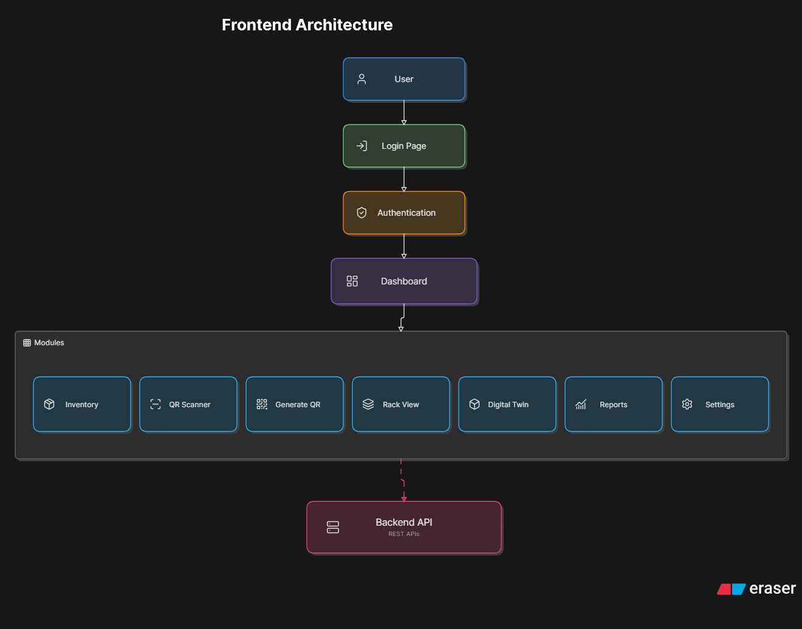

# 🎨 Paint RM Monitor: Frontend Client

The frontend client of the Paint RM Monitor is a modern, responsive single-page web application built with **React 19**, **TypeScript**, and **Vite**. It features a glassmorphic interface, dark/light theme options, a real-time 3D warehouse digital twin, an edge-based QR scanner console, and visual telemetry dashboards.

<p align="center">
  
</p>

## 🚀 Key Modules & Interfaces

### 🌐 3D Warehouse Digital Twin
Provides an interactive spatial grid mapping the physical racks, current capacities, safety thresholds, and real-time color codes sync'd directly with DB triggers.

<p align="center">
  
</p>

### 📊 Analytics Telemetry Dashboard
Uses **Recharts** to render live daily transaction frequency, inventory depletion risks, and rack utilization ratios.

### 📷 Camera QR Scanner Console
Fully responsive camera view utilizing local **jsQR** client decoding for instant, zero-latency scanning of material batches.

---

## 🛠 Tech Stack & Dependencies

- **React 19 & TypeScript**: Component-driven architecture with static safety.
- **Tailwind CSS 4.0**: Futuristic neon grid interfaces, glassmorphic widgets, and state transitions.
- **Vite**: Ultra-fast bundler and hot-module replacement dev server.
- **Recharts**: Data visualization layers.
- **jsQR**: Web-camera scanning pipeline running locally.

---

## 💻 Development & Setup

### Prerequisites
- Node.js (v18.x or v20.x recommended)
- npm (v9.x+)

### Installation
1. Install dependencies:
   ```bash
   npm install
   ```
2. Start the hot-reloading development server:
   ```bash
   npm run dev
   ```
3. Open the client in your browser at `http://localhost:5173`.
